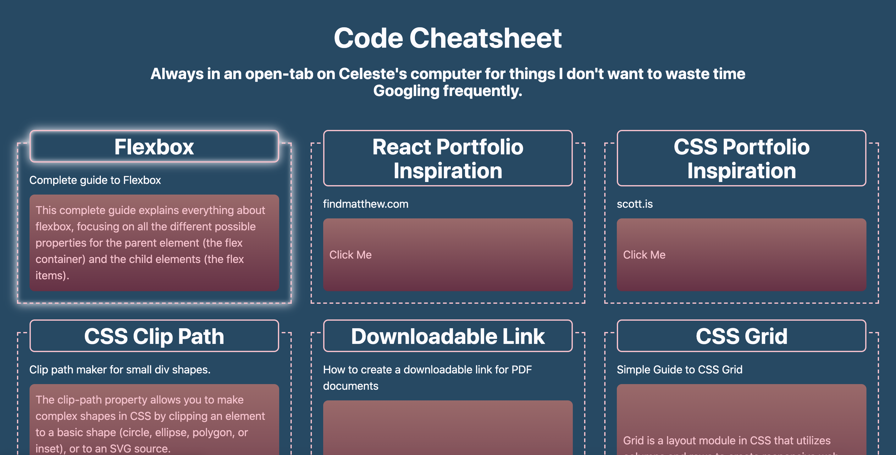

# Cheat-Sheet

### _This repo is exactly what it sounds like._

---

## Table of Contents

- [Description](#Description)

- [Media](#Media)

- [Deployed Site](#deployed-site)

- [Contributors](#Contributors)

- [Contact](#Contact)

- [Project Status](#project-status)

- [License](#License)

---

## Description
    A collection of code-links that allows me to quickly access answers to things I find myself constantly Googling.

## Media

## Deployed Site

https://celestealexmoore.github.io/Cheat-Sheet/

## Contributors

This website was created by Celeste Moore.

## Contact

If you have any questions about this repository, contact celestealexmoore via GitHub or reach out via email:
celestealexmoore@gmail.com.

## Project Status

Permanently Ongoing

---

## License

© 2021 _celestealexmoore_